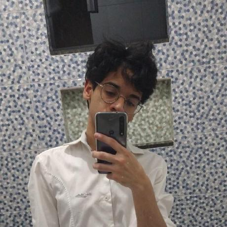
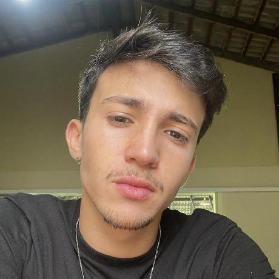
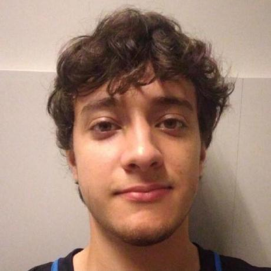

    <h1 class="title">VLC Media Player</h1>
    
O <a href="https://www.videolan.org/">VLC Media Player</a> é um software open source e gratuito que permite a reprodução de vários formatos de mídia. Nessa documentação, estão dispostos os artefatos produzidos no decorrer da disciplina de Interação Humano Computador da Universidade de Brasília (UnB). O objetivo primário do projeto é de analisar os requisitos presentes no aplicativo VLC Media Player.

<h2 class="title">Contribuidores</h1>

    

        
    

    

        <h3 class="title1">Bruno Ribeiro</h1>
        <a href="https://github.com/BrunoRiibeiro">https://github.com/BrunoRiibeiro</a>
    

    

        
    

    

        <h3 class="title1">Francisco Mizael</h1>
        <a href="https://github.com/frmiza" >https://github.com/frmiza</a>
    

    

        
    

    

        <h3 class="title1">Giovanni Alvissus</h1>
        <a href="https://github.com/giovanni1106" >https://github.com/giovanni1106</a>
    

    

        
    

    

        <h3 class="title1">Igor Penha</h1>
        <a href="https://github.com/igorpenhaa" >https://github.com/igorpenhaa</a>
    

    

        
    

    

        <h3 class="title1">Larissa Gomes</h1>
        <a href="https://github.com/larigs" >https://github.com/larigs</a>
    

    

        
    

    

        <h3 class="title1">Lucas Gobbi</h1>
        <a href="https://github.com/LucasBergholz" >https://github.com/LucasBergholz</a>
    

    

        
    

    

        <h3 class="title1">Rafael Bosi</h1>
        <a href="https://github.com/StrangeUnit28" >https://github.com/StrangeUnit28</a>
    

<h2 class="title">Histórico de Versões</h2>
 

| Versão | Data    | Descrição                 | Autor(es)     |  Revisor(es)  |
| :-: | :-: | :-: | :-: | :-: |
| `1.0` | 15/04/2023 | Primeira Versão da GitPage | Lucas Gobbi | Bruno Ribeiro |
| `2.0` | 15/04/2023 | Adição opção de contraste | Larissa Gomes | Giovanni Alvissus |
| `2.1` | 15/04/2023 | Atualização da GitPage para o VLC | Larissa Gomes, Lucas Gobbi | Giovanni Alvissus |

