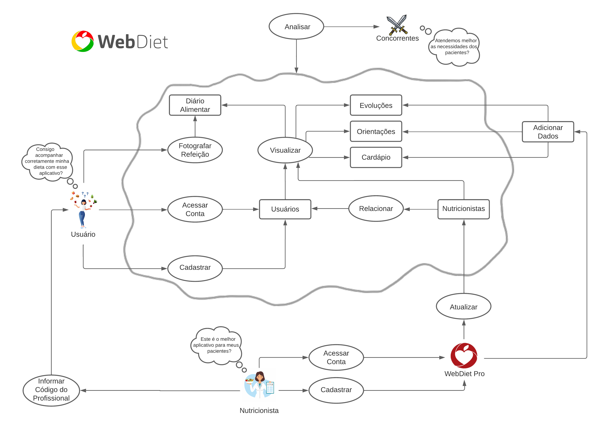
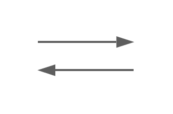
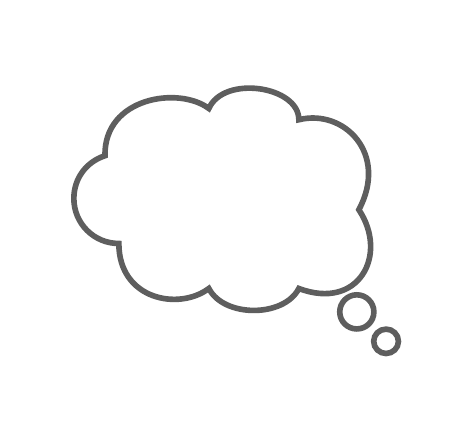

# Rich Picture

## Introdução

O WebDiet é um aplicativo voltado para a gestão de dieta e alimentação saudável. O Rich Picture do WebDiet mostra os usuários interagindo com o sistema, além de mostrar fatores externos que estão ligados ao sistema, como os nutricionistas e os concorrentes. Ele fornece uma visão abrangente do funcionamento do aplicativo.

 

## WebDiet

    

 Imagem 1: Rich Picture (Fonte: Larissa Gomes, 2023).

 

## Legenda
| Icones | Componente |  Descrição |
|-----------|---------|---------|
|  | Ator | Usuário |
|  | Ator | Nutricionista |
|  | Ator | WebDiet para os Profissionais |
|  | Ator | Concorrentes |
|  | Operações | Operações do sistema |
|  | Bancos de Dados | Bancos de Dados do Sistema |
|  | Setas | Indicam o fluxo de dados |
|  | Balão | Demonstram as preocupações dos atores quanto ao sistema |
|  | Limite | Limite do sistema |

 Tabela 1: Legenda Rich Picture (Fonte: Larissa Gomes, 2023).

 

## Bibliografia

[1] MONK, Andrew; HOWARD, Steve. The Rich Picture: A Tool for Reasoning About Work Context. Methods and tools, 1998.
[2] SALES, André Barros. Introducing Rich Pictures. Disponível em: https://aprender3.unb.br/pluginfile.php/2523045/mod_resource/content/2/1_5145791542719414573.pdf. Acesso em: 17 de abril de 2023;

## Histórico de Versão

|   Versão   | Data  |                      Descrição                      |    Autor(es)     |  Revisor(es)  |
| :--------: | :---: | :-------------------------: | :--------------: | :-----------: |
| `1.0` | 16/04/2023 | Criação do Rich Picture | Larissa Gomes | Giovanni Alvissus |
| `1.1` | 17/04/2023 | Adição das bibliografias | Larissa Gomes | Giovanni Alvissus |

 Tabela 2: Histórico de versões (Fonte: Larissa Gomes, 2023). 
